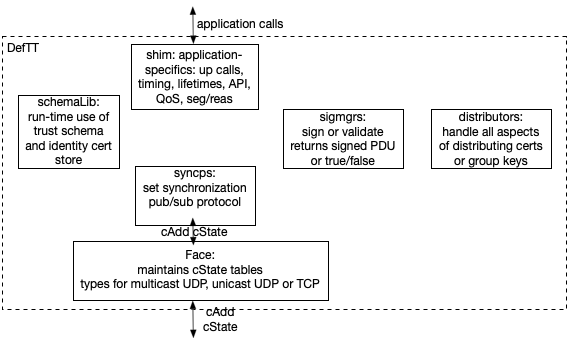

# DeftT run-time modules

The Defined-trust Transport is defined in an Internet Draft, draft-nichols-iotops-defined-trust-transport. It is used in the *examples* in this repo and is implemented using library modules in *include*. The modules roles are described below.

DeftT's required functionality is broken into modules that have been implemented in libraries (under *include/dct*). DeftT is organized in functional modules that may provide services to other modules in the course of preparing application-level information for transport and for extracting application-level information from packets. Extensions and alternate module implementations are possible but the functionality and interfaces must be preserved. Following good security practice, DeftT's Publications are constructed and signed early in their creation, then are validated (or discarded) early in the reception process. The signing and validation modules (*signature managers*) are used for both Publications and cAdds.The *schemaLib* module provides certificate store access throughout DeftT along with access to *distributors* of group keys, Publication-building and structural validation, and other functions of the trust management engine. This organization would not be possible in a strictly layered implementation. 

The figure shows the DC modules which are organized in libraries under *include/dct*. The component descriptions and interactions can appear complex but the internals of DeftT are completely transparent to an application and the reference implementation is efficient in both lines of code and performance. Where there are alternatives, the trust schema completely determines which modules are used. A DeftT participates in two required collections and MAY participate in others if required by the schema-designated signature managers. One of the required collections handles the Publications that carry out application communications and uses "pubs" for the descriptive collection name component. The other required collection manages the certificates of the trust domain and uses "cert" for the descriptive collection name component. Specific signature managers MAY require group key distribution in descriptive-named Collection "keys."



A shim serves as the translator between application semantics and the named information objects (Publications) whose format is defined by the trust schema. Besides the shim, DeftT components are not application-specific. New signature managers, distributors, and Face modules may be added to the library to extend features. 

## Syncps

Syncps has roots in the sync protocols developed for Information-Centric Networking, e.g., [CBIS], over the past decade. A DC sync protocol MUST provide mechanisms that are end-point agnostic, be broadcast-friendly, and have an efficient implementation. Syncps has been in development to meet these needs, starting with [DNMP].  It currently appears that syncps is the only sync protocol DC needs so discussion of the sync protocol module is explicitly syncps. Future uses and research developments may lead to new sync protocols suitable for DC but they must fulfill the same role in the transport and provide the same interfaces as syncps.

Syncps performs set reconciliation over the Publications of a Collection, providing the enabling protocol for any-to-any communications. Currently, a single syncps instance manages a single collection. Each syncps announces the Publications it currently has in its Collection by sending a cState containing an IBLT [IBLT]. Syncps  manages both active and inactive Publications to know when and if to communicate them to peers (though Face) and subscribers (via upcalls), but it knows nothing about the format or semantics of Publications. Upcalls from syncps to other modules provide validation and expiration information for Publications as well as validation and signing of cAdds. If a cAdd fails to validate, it is silently discarded. Syncps can confirm that Publications have reached their collection if an optional callback handler is provided. This feature piggybacks on normal syncps dynamics, reporting when that Publication appears in the state summary of some other entity. As such, it should not be used as a measure of the transmission time of a Publication.

Syncps keeps its DeftT instance synchronized within the sync zone at the attached Face. It adds new DeftT-local Publications to the collection and transfers validated, subscribed Publications to a shim (or distributor). Syncps creates two PDUs to manage collections: a cState, which summarizes the current state of its Collection and a cAdd, used to respond to received cStates with any applicable Publications (i.e., cAdd carry Publications). Syncps subscribes to everything in a Collection. The Publications that initiate upcalls can be limited by the shim in setting up subscriptions with syncps.

As these dynamics are exactly that of Named-Data Networking's Interest (cState) and Data (cAdd) packets, the DeftT reference implementation uses a restricted subset of that format for its PDUs along with its own broadcast-optimized Face protocol. (DeftT does not utilize a NDN forwarder or implement the full NDN protocol.)

## SchemaLib trust management

SchemaLib implements the trust management engine of DeftT. It validates certificates, uses the trust schema, and instantiates the distributors required by the trust schema.

When a DeftT is instantiated, it is handed its identity bundle which contains the trust anchor for the trust domain, the particular (compiled) trust schema for the domain and the signing identity chain for the DeftT. This component performs validation of these certificates and they are stored locally. Templates for all the legal (according the the trust schema and the signing identity) Publications are created and saved to use whenever a new Publication is constructed, ensuring its structural validity. 

The DeftT's certificate distributor publishes all the public certs in its chain in order to connect to the collections used by this DeftT. A DeftT is not connected until a delivery indication has been received for its identity certificate chain. If information privacy is required in the trust schema, the distributors for the required keys are instantiated.

Signing identities published by others are received, validated, stored and used to create templates for structural validation of Publications that originate with those signing identities.

## Distributors 

Distributors manage Collections (e.g., for certificates and keys) transparently to applications through their own syncps.  A *certificate distributor* MUST be provided in order to manage the signing certificate collection for any application. Its Publications are signing chain certificates and when a DeftT is first instantiated it is used to publish the certs of its own signing chain. The cert distributor must confirm their delivery to the cert Collection (i.e., shows up in an IBLT summary originated by a different DeftT) before the DeftT upcalls to the application that it can start communications. The cert distributor passes subscribed certs to schemaLib where validated certificates are stored; invalid certificates are silently discarded.

The use of *group key distributors* is dependent on the signature manager selected. AEAD, PPAEAD, and PPsigned require group key distributors to manage a key Collection. The distributor library contains a group key distributor for AEAD as well as a group key distributor for publisher privacy. These use the capabilities contained in signing identities to determine eligibility to be a group's key maker and eligibility to subscribe (decrypt) Publications in a publisher privacy collection. Key maker election, key creation (and re-creation), and key distribution are all handled by the distributors and transparent to the application.

A trust domain virtual clock distributor provides a way for a trust domain to converge on a virtual clock for use in publications if domain members have widely varying system clocks. A log distributor proviides a way to distribute log messages.

## Signature managers

Signature Managers (sigmgrs) implement the signing and validation of Data (which may include encryption/decryption) selected by the trust schema for Publications and their cAdd as well as by the particular signing and validation required by distributors. Use of an encryption sigmgr requires a group key distributor. Integrity signing and null signing is not available in trust schemas (i.e., not used to specify Publications or their cAdd) and are only used in certificate and key distribution.

The library currently implements six sigmgrs:

- EdDSA using the DCT member cert

- RFC7693 and SHA256: integrity (used by DeftT distributors and not available to trust schemas)

- AEAD encryption/decryption for an entire sync zone where the key is created, distributed and updated by the group key distributor. The key distributor encrypts the group key individually for each valid signing identity that has been published in the cert Collection (validated and stored locally). Members are added to the group as their validated signing identities become known; no members are added apriori.

- PPAEAD is a version of AEAD encryption/decryption where the encryption key is unique to a particular publisher and the group of authorized subscribers. Authorized subscribers must have the required capability in their signing chain and the subscriber group key pair is distributed by a subscriber group key distributor which creates (and updates) a key pair for the subscriber group, putting the public key in the clear and encrypting the secret key for each subscriber group member. Data can only be decrypted by authorized subscribers (subscriber group members).

- PPsigned adds EdDSA signing and validation to PPAEAD. Its use is indicated if there is a need to protect against authorized members of the subscriber group forging packets from Collection publishers. The encrypted packet is also signed by the publisher. Uses the same subscriber group key distributor as PPAEAD.


## Faces

Faces translate between the cAdd and cStates of the sync protocol and the system packet transport in use. Any packet transport can be used as long as it provides:

- send packet and register callback for received packet
- connect registration callback invoked when packets can be sent or received
- information callback - MTU is returned

DeftT currently implements a broadcast Face that is used with UDP multicast over IPv6 and a unicast face over UDP or TCP. The DCT Face derives that of NDN, where cState are Interests and cAdds are Data, but its structure has been optimized for use on broadcast media and to interact directly with a sync module, not a forwarder node. The Face keeps:

- Pending Interest Table (PIT): similar to its use in CCN and NDN, this is a table of unsatisfied Interests. Interests are removed when a corresponding Data arrives ("satisfies the Interest") or the Interest times out (when its lifetime has been exceeded).
- Registered Interest Table (RIT) : this is used to hold the Interest type that this DeftT can respond to
- Duplicate Interest Table (DIT): is used to keep Interests from looping (without the need for a spanning tree) and tracks the Interest plus its nonce. (A cAdd is never sent to the Interface on which it arrived.) 

## Shims and APIs

A shim is application-class-specific, converting between application-meaningful messages and DeftT's Publications. A shim is passed the salient information about a particular communication and its application level data unit and uses these to create trust schema compliant Publications, using knowledge about this application class and calls to schemaLib modules. A shim parses received Publications for call back(s) to the application. A shim can be customized to a particular application (the approach taken in the now-obsolete [DNMP]) or can provide more general communication models, such as pub/sub, streaming, request/response.

This latter approach has been used to create a message-based publish/subscribe (MBPS) API whose semantics resemble MQTT but the protocol is brokerless and collection-secure, unlike MQTT. MBPS handles breaking application-level messages into trust schema specified Publications and provides an option for delivery confirmation to be passed to the application. MBPS has been used for multiple applications: two examples are in [@DCT] and Operant has used for other applications. MBPS provides a simple API that hides network layer and security details and offers two levels of message QoS: a default unacknowledged delivery and a confirmation that the publication has reached at least one other member of the collection. Applications can use the following MBPS methods:

connect(successCB, <opt>failureCB): Performs set up (if any) necessary to allow communications to start.  (e.g., signing key distribution is carried out). Invokes appropriate callback, success or failure.publish(msg, args, <opt>confCB): Publishes the given message content and returns a unique message ID. If a confirmation callback is included, mbps invokes confCB with an indicator of success or failure of the message.

subscribe(handler): subscribes to all the topics in the pubs Collection. A received message's underlying publication(s) is validated before the handler is invoked.
subscribe(topic, handler): distinguishes application-level subscriptions further by topic (component(s) of name that mbps will append to the pubPrefix of the trust schema) and passes a handler to use for a particular topic.

run(): once application set up is finished, this turns over control to the transport.

The API simplicity is shown in this application snippet:

```c++
void msgPubr(mbps &cm, const auto& toSnd) {
    //... lines of code to prepare arguments
    cm.publish(toSnd, a); //load arguments in a
}
static void msgRecv(mbps &cm, const auto& msg, const msgArgs& a) {
    //... do something with msg
}
int main(int argc, char∗ argv[]) {
    mbps cm(argv[optind]); // make shim using identity bundle
    cm.subscribe(msgRecv);
    cm.connect([&cm]() {
        ... // prepare toSnd
        msgPubr(cm, toSnd);
    });
    cm.run();
}
```

# Formats

Application information is packaged in Publications which are carried in cAdds that are used along with cState PDUs to communicate about and synchronize Collections.
This section documents the format of Publications, cStates, and cAdds along with certificates, which are a special case of Publication (where keys are the information carried).
A restricted version of the NDNv3 TLV encoding is used, with TLV types from NDN's TLV Type Registry [@NDNS]. Publications and cAdds use a compatible format which allows them to use the same library signing/validation modules (*sigmgrs*) and the same parser.

In Tables 1-3, the Type in level *i* is contained within the TLV of the previous level *i-1* TLV.

## Publications

Publications are used throughout DeftT's modules.
A Name TLV is used to encode the name defined in the trust schema.
A Publication is valid if it starts with the correct TLV, its Name validates against the trust schema and it contains the five required Level 1 TLVs in the right order (top-down in the table) and nothing else.
MetaInfo contains the ContentType (in DeftT either type Key or Blob).
The Content carries the named information and MAY be empty.
SignatureInfo indicates the SignatureType used to select the appropriate signature manager ((#signature-managers)).
The SignatureType for a collection's Publications is specified in the trust schema and each Publication MUST match it.
(A list of current types can be found in file *include/dct/sigmgrs/sigmgr.hpp*.)
The KeyLocator associated with the SignatureType follows then the ValidityPeriod (if the Publication is a Certificate).
Finally, SignatureValue is determined by the SignatureType and its format is verified by the signature manager.

| Level 0                   | Level 1        | Level 2            | Comments                                                     |
| ------------------------- | -------------- | ------------------ | ------------------------------------------------------------ |
| Type                      |                |                    | MUST be Data                                                 |
|                           | Name           |                    |                                                              |
|                           |                | Generic (or other) | trust schema sets number of and constraints on these         |
|                           | MetaInfo       |                    |                                                              |
|                           |                | ContentType        | MUST be type Key or Blob                                     |
|                           | Content        |                    | arbitrary sequence of bytes including embedded TLVs; MAY have length 0 |
|                           | SignatureInfo  |                    |                                                              |
|                           |                | SignatureType      | Value indicates which signature manager                      |
|                           |                | KeyLocator         | Absent for integrity-only signature types                    |
|                           |                | ValidityPeriod     | Only for Certificates                                        |
|                           | SignatureValue |                    | Packet signature (format determined by SignatureType)        |
| Table: Publication format |                |                    |                                                              |

## Certificates

Certificates (certs) are Publications with the ContentType set to Key and both a KeyLocator and a ValidityPeriod. DCT certs are compatible with the NDN Certificate standard V2 but adhere to a stricter set of conventions to make them resistant to substitution, work factor and DoS attacks. The only KeyLocator type allowed in a DCT cert is a KeyDigest type that MUST contain the 32 byte SHA256 digest of the *entire* signing cert (including SignatureValue). A self-signed cert (such as a trust anchor) MUST set this digest to all zero. This digest, a cert *thumbprint* [IOTK], is the only locator allowed in *any* signed DC object (e.g., Publications, cAdd, schemas, certs) and MUST be present in every signed object. A signed object using any other type of locator will be considered unverifiable and silently ignored. Certificate Names use a suffix:

```
  KEY/<keyID>/dct/<version>
```

where the cert's thumbprint is the keyID and its creation time is the version.

The original publisher of any signed object MUST ensure that that *all* certs, schemas, etc., needed to validate the object have been published *before* the object is published. If an entity receives a signed object but is missing any of its signing dependencies, the object should be considered unverifiable and silently ignored. Such objects MUST NOT be propagated to other entities. 

## cState

cState and cAdds are are the PDUs exchanged with the system-level transport in use (e.g., UDP) but are only used by the Sync (sec A.1) and Face (sec A.5) modules. Sync creates cState and cAdd PDUs while the Face manages the protocol interaction within the trust domain. A cState PDU (shown in the table below) is used to report the state of a Collection at its originator.  A cState serves to inform all subscribing entities of a trust domain about Publications currently in the Collection, both so an entity can obtain Publications it is missing and so an entity can add Publications it has that are not reflected in the received cState.

| Level 0              | Level 1  | Level 2 | Comments                           |
| -------------------- | -------- | ------- | ---------------------------------- |
| Type                 |          |         | MUST be Interest                   |
|                      | Name     |         |                                    |
|                      |          | Generic | trust domain id                    |
|                      |          | Generic | descriptive collection name        |
|                      |          | Generic | collection state (sender's view)   |
|                      | Nonce    |         | uniquely distinguishes this cState |
|                      | Lifetime |         | expiry time (ms after arrival)     |
| Table: cState format |          |         |                                    |

A cState is valid if it starts with the correct TLV and it contains the three required Level 1 TLVs in the right order (top-down in table) and nothing else. Its Name MUST start with the trust domain id of the DeftT, then a descriptive Collection name (of at least one component) and finally a representation of the the state of the Collection at the originator. There is no signature for a cState PDU. (The cState format is a restricted subset of an NDNv3 Interest.) 

## cAdd

A cAdd PDU is used to add Publications to a Collection and carries Publications as Content. A cAdd PDU is created after a cState is received and only if the recipient has Publications that are not reflected in the recipient's local state. A cAdd is valid if it starts with the correct TLV, contains the five required Level 1 TLVs in the right order (top-down in table) and nothing else. A cAdd name MUST be identical to the cState to which it responds.

| Level 0            | Level 1        | Level 2        | Comments                                                     |
| ------------------ | -------------- | -------------- | ------------------------------------------------------------ |
| Type               |                |                | MUST be Data                                                 |
|                    | Name           |                |                                                              |
|                    |                | Generic        | trust domain id                                              |
|                    |                | Generic        | descriptive collection name                                  |
|                    |                | Generic        | collection state (from cState) to which the Content's Publications are to be added |
|                    | MetaInfo       |                |                                                              |
|                    |                | ContentType    | MUST be type cAdd                                            |
|                    | Content        |                |                                                              |
|                    |                | Publication(s) | one or more Publications to add to the Collection            |
|                    | SignatureInfo  |                |                                                              |
|                    |                | SignatureType  | Value indicates which signature manager                      |
|                    |                | KeyLocator     | Presence depends on SignatureType                            |
|                    | SignatureValue |                | Value holds the signature for this PDU                       |
| Table: cAdd format |                |                |                                                              |

## References

[CBIS] Jacobson, V., Braynard, R., Diebert, T., Mahadevan, P., Mosko, M., Briggs, N. H., Barber, S., Plass, M. F., Solis, I., Uzun, E., Lee, B., Jang, M., Byun, D., Smetters, D. K., and J. D. Thornton, "Custodian-based information sharing", 2012, <https://doi.org/10.1109/MCOM.2012.6231277>.

[DNMP] Nichols, K., "Lessons Learned Building a Secure Network Measurement Framework Using Basic NDN", September 2019.

[IBLT] Goodrich, M. T. and M. Mitzenmacher, "Invertible bloom lookup tables", 2011, <https://doi.org/10.1109/Allerton.2011.6120248>.

[IOTK] Nichols, K., "Trust schemas and {ICN:} key to secure home IoT", 2021, <https://doi.org/10.1145/3460417.3482972>.
