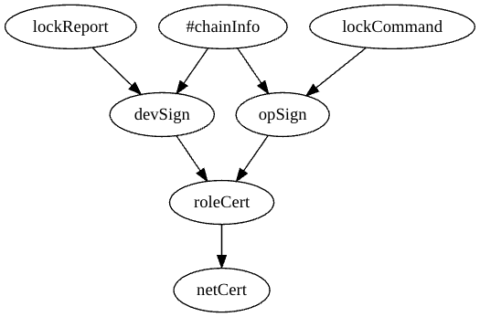

# Examples

These directories are included to illustrate how DCT can be used and to perhaps spark new ideas. Real solutions use similar approaches.

- hmIot: The README in this directory may be useful in understanding how DCT's modules can be used.

- office: another example, originally developed for a tutorial at the 2021 ACM ICN conference

- lpubpriv: very simple location-based example to illustrate publisher privacy signature managers.

- relay: directory for relays and usage examples

Writing trust schemas in VerSec's language and creating identity bundles can be somewhat tedious, but both of these should be amenable to automation.

To aid in debugging and understanding, the digraph portion of the output generated by schemaCompile with the -d or -D option can be pasted into the left hand panel at sketchviz.com to create the possible cert chains. For example, using tools/schemaCompile -D on examples/hmIot/iot1.trust:

The examples have all been updated to use the identity access functions in the **/util** subdirectory. Although the examples all still read their identity bundles from a file passed in the command line, there are callback functions provided to a DeftT during shim creation that are used to access the certificates from the bundle. These new functions can be used as a basis for creating secure functions that are now passed to a DeftT through shim creation. This change includes locally (should be done securely in an actual deployment) generated signing key pairs that are signed by the configured identity certs so they can be regenerated periodically. This has necessitated changes in the trust schemas from those that used the configured identity certs as signing certs. In some cases, the READMEs may not reflect these changes.
