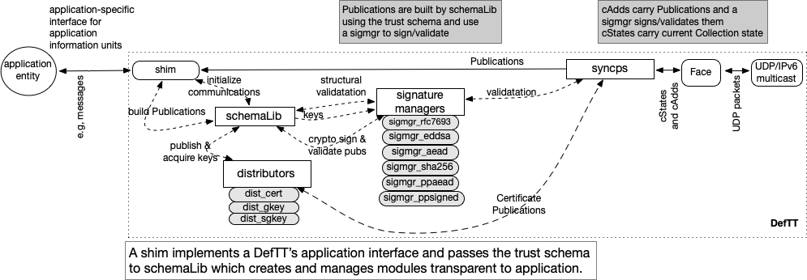

# Home IoT Example using Message-Based Publish/Subscribe (mbps) shim

The examples in this directory use a message-based pub/sub shim from DCT's library that presents applications with an MQTT-inspired interface in a DeftT. This directory contains three example applications, with a home IoT flavor and three versions of its communication schema.  Examples use a DeftT presenting an API based on *messages* as an application level unit of information. Unlike its MQTT inspiration, an mbps DeftT is *brokerless*, its entities connecting instead to a (fully distributed) *trust domain*. Three different levels of communication security are supplied in the three example communication schemas: iot{0-2}.rules. The applications remain the same (same binary).  When started, individual application entities are given an *identity bundle* containing the trust anchor, the binary schema, and their own member identity. It is this identity bundle that determines the particular trust domain the entity joins. The mbps shim lets entities publish and subscribe to messages in a particular trust domain; all mechanics of the trust domain are transparent to an application which only "sees" a message space.


Messages for a target may be further specified with subtopics and subscriptions can be particularized by these or may just subscribe to all messages (in the DeftT's pub collection). mbps-DeftT connects to a *trust domain* not a server or broker, and its implementation reflects that. For example, in MQTT, a message of type CONNECT is the first packet sent from the client to the server and MQTT applications typically call a client *connect* method, passing in a callback function that handles a CONNACK message from the server. Since mbps presents a serverless API for a distributed transport, its *connect* method is used to do **all** initialization required in order to communicate as a member of the trust domain (publish and acquire keys, etc), then calls back to an application handler once communications become possible.

## Build notes

These examples work on Macs and Linux and uses IPv6 multicast. See *Installing and building the pieces* in the DCT/README.md file. After cloning the DCT repo, do a 'make' in your examples/hmIoT directory. 

## Using the examples

This **hmIot** directory contains two applications (app1.cpp, app2.cpp) and three different text file communication schemas: iot{0,1,2}.rules. The example applications are meant to provide simple illustrations of the use of  DeftT with the mbps shim, Versec schema creation, and use of DCT tools. Each schema implements a different security model that can be used with any of the applications interchangeably. The iot1 and iot2 communication schemas use a  signing chain where publications are signed by a signing cert that is signed by a role cert that is signed by the root cert. Each member is configured with a private key corresponding to its identity (role) cert. This identity is used to sign a cert made of the public key of a locally (at the entity) produced signing key pair. This allows for new signing keys to be made periodically without any additional configuration.

The iot0 schema checks that cAdds and Publications are signed by a valid cert (same trust root) and follow a basic format, but doesn't enforce any particular role cert (in contrast, iot1.rules and iot2.rules only let *operators* issue commands). In iot1, publications are signed with their signing keys using the EdDSA signature manager (DCT's cert distributor automatically publishes its own signing key chain during connect and acquires and validate that of others continuously) and Data packets are signed by their sender using the EdDSA signature manager. The iot2 rules schema requires the AEAD signature manager for Data packets so those  will be encrypted (DCT's group key distributor is invoked automatically during connect to make and securely distribute those keys) while the Publications use the EdDSA signature manager. Entities **must** publish their signing chains before they can communicate ("join the trust domain") through DeftT.

 In the example applications, *operator* roles subscribe to all messages in the application domain and device roles only subscribe to the **command** topic and locations matching their IDs and the location designator *all*.  A single handler function (*msgRecv*) is used for all subscriptions. The *connect* lambda sets up subscriptions, creates the first message body and invokes *msgPubr* which uses mbps's publish function and schedules another message to be sent. The mbps *run*() is called after *connect*().  The files also have examples of using message confirmation (roughly similar to MQTT QoS 1). (Note that message confirmation time reflects Face protocol timing and is typically longer than the time for a message to be received in the collection and time to confirmatioin should not be used as a performance metric.)

#### Creating Identity Bundles

Identity bundles are required to run these examples. The bundles contain, in order, the trust root certificate, the schema to be used (in cert form and signed by the trust root), and the identity chain for the entity's member identiy. Bundles do **not** contain the certs of other devices that will be part of the trust domain. The schema, common root-of-trust, and run-time library, allow entities to discover new members dynamically by validating the new signing chains that appear in a cert collection. The DCT/tools directory supplies utilities to create certs and id bundles and, for these examples, an application is invoked directly with its identity bundle (including private identity key, not a part of a deployment bundle). The text file rules can be compiled using schemaCompile.

Acting as a Configurer, first, use schemaCompile to compile the text file of trust rules into a binary schema, for iot*n*, e.g.:

 `schemaCompile -o iot1.scm iot1.rules`

Next, a trust anchor (root) cert for this network and domain is created as a self-signed cert. The -s option is for the publication signature manager, the -o names the output file and finally the publication prefix for this application domain is listed:

 `make_cert -s EdDSA -o iot1.root iot1`

The output file contains a cert with the public key as content and the associated private key. The next step is to make a cert carrying the schema binary signed by the root cert in accordance with rules in the schema: 

  `schema_cert -o iot1.schema iot1.scm iot1.root`

The cert content is the schema binary so there is no signing key in the output file. Next, make identity certs that are signed by the trust anchor. Make one for each planned instance of the application, particularizing by role (here **operator** or **device**) and by specifying an id within that role, e.g.:

 `    make_cert -s EdDSA -o alice.cert iot1/operator/alice iot1.root`

Make an identity bundle for each of these certs using the make_bundle utility in the tools directory, this one is given the identity name, e.g.:

 `make_bundle -o alice.bundle iot1.root iot1.schema +alice.cert`

The "+" on the role cert indicates that its identity (private) key should be included in the bundle. (This is just for examples. For deployment, the private key is securely configured.) The other certs in the bundle don't (and shouldn't) have private keys. In order to run the applications, at least two identities are needed, so make at least two bundles. In general, more identity bundles can be made later for additional application instances. A shell script *mkIDs.sh* is included that will generate five example bundles for the rules file given on the command line.

#### Running the examples

At least two application entities should be started or no communications can happen.  app1 publishes the given number of messages, sending a short message each time. If the -p option is set, the application will persist waiting for more messages. 

*Example usage:*

`app1 -c 10 <identity>.bundle `  *or* `app1 -c 10 -p <identity>.bundle `

app2 publishes an initial message and waits to receive a message before scheduling another message publication at a short delay.

*Example usage:*

`app2 <identity>.bundle`

In addition to a message body, mbps's *msgParms* struct is used to pass additional information about a message that is needed by the transport. These parameters are required by the schema to fill in some of the *tags* defined for Publications. Looking at the supplied schemas, you will see which tags need to be set by the application (no leading "_" and not set in mbps) and that the applications supply them, e.g.:

```
msgParms{{"target", capability},{"topic", "event"s},{"trgtLoc",myId},{"topicArgs", myState}}
```

Tags can be accessed in a received message from the mbpsMsg structure and the applications show this in their msgRecv() methods.

## Elements of DeftT

This discussion contains more information about how the mbps shim uses the DCT library than is necessary in order to simply write applications and schemas. 

mbps is passed the identity bundle to distribute to other modules of DeftT. This section provides an overview of the module interaction. This has been an area of active work, but the current modules and their interactions are fairly stable. The modules that **uniquely** define a particular instance of DeftT are the shim selected  (here DCT/include/dct/shims/mbps.hpp) and the schema (e.g., iot0.rules) . The shim translates application messages into secured Publications (and Publications to messages) that are used by its *syncps* protocol that manages the set synchronization of a particular Collection of Publications using cState and cAdd PDU. Publications have distinct name components (schema tags) and a content portion that holds the message or a segment of a large message. (Publications are encapsulated in cAdds, which are passed to the associated Face through syncps.)

DCT's library is currently separated into six directories that cover different functionalities: syncps (the syncPubSub object and its helpers), sigmgrs (sign and validate Data using different algorithms), distributors (maintain distributed cert or key collections), schema (holds the schemaLib modules), face (implements a specialized version of NDN Interest/Data exchanges with cState as Interests and cAdds as Data), and shims (for general-purpose DeftT API modules). The figure shows the modules of DeftT as it uses a UDP/IPv6 multicast interface to send and receive packets on a local network. In addition to the cryptographic signing and validation of Data packets (e.g., RFC7693, EdDSA, SHA256, AEAD), the schemaLib is employed to do construction and structural validation of Publications, ensuring that all of the schema's naming constraints hold for the publication and its signing chain.  DCT does not permit schemas to specify integrity signing (RFC7693 or SHA256) for publications as this violates DeftT's security model, but these are used within distributors during initialization.



### MBPS Publication Names

Each syncps handles the synchronization of Publications within a single collection. DeftT uses a collection for the publications that carry application messages (<schemaTP>/**pubs**), a collection for the signing cert chains (<schemaTP>/**cert**), and, if encryption is specified, a collection for the symmetric group keys (<schemaTP>/**keys**). The latter two are completely transparent to the application while the **pubs** collection is accessed through the shim. Publication names are constructed according to the following table, where the component structure can be used for hierarchical topic and subtopic handling and the individual components are specified in, and can be secured through, the domain's schema. The last three components are required and set by mbps. The rest depend on the particular schema, both in the number of components (tags from the schema definition) and whether they must be supplied by the application through the mbps API. Any component (tag) in the publication definition(s) in the schema that does not have a leading "__" and is not one of the final three components must be supplied.

| component | description                                                                                                                                  |
| --------- | -------------------------------------------------------------------------------------------------------------------------------------------- |
| networkID | This is a single component in our examples, denoting the domain of **iot**{1,2,3}. Multiple components might be needed for some deployments. |
| target    | a capability, attribute, property                                                                                                            |
| topic     | gives the type of message (command, report)                                                                                                  |
| trgtLoc   | target location id or alias, e.g. device(s), room, local, component (smartthings)                                                            |
| topicArgs | more specific information for this topic                                                                                                     |
| origin    | identifies the publisher: role-specific ID and deviceID                                                                                      |
| msgID     | unsigned 32 bit number to uniquely identify each message                                                                                     |
| sCnt      | unsigned 16 bit integer; indicates if single publication message or multiples (see below)                                                    |
| mts       | time mbps client receives message from application process in UTC microsecs                                                                  |

A target is the "audience" for the Publication. This can be used in many ways, but one (IoT-centric) way to think of it is as a *capability* e.g., lock, alarm, colorControl, motionSensor that can be available at a device. In general, topic can be used in many ways; in these examples it indicates the type of message carried, e.g. an event, a command, or a status. The target location can be a particular device, class of device, component of a device, a room, a vicinity. The arguments can supply any additional information associated with that topic. The origin component can be used to identify the publisher (only used for debugging), msgID is  set to a hash in mbps. sCnt is packaged in an unsigned 16 bit integer which, if not 0 to indicate a single publication message, uses the upper 8 bits for the sequence of this piece within the total message and the lower 8 bits for the total number of pieces in the message. This means that any message must fit into 255 publication segments (so byte-limited to maximum content size times 255) but the current shims limit the number of segments to 64 for an efficient implementation and for the iblt implementation, the limit should be kept under 80.

### Confirmation of Publications ("QoS")

MBPS provides mechanisms that enable applications to set a callback (if desired) indicating whether its message made it into the collection. This piggybacks on mechanisms in syncps that can check that a Publication a particular syncps originated was seen in a cState issued by another entity. Methods in the shim can be selected that ensure all the Publications of any particular message have been confirmed. This gives an indication of message publication "success" roughly analogous to MQTT's QoS 1. Due to the mechanics and timing of the protocol, it does **not** give a performance metric of how long it took for a particular Publication to reach at least one destination, typically being longer on the order of milliseconds.

It is invoked at the application by passing a callback to the mbps publish() method as the third argument. If the callback argument is not used, the option is not employed by the client. (Although mbps may or may not use it for publications, the mechanism is employed for initial signing key distribution in the connect method, transparently to the application.)

### Notes on the included schemas

Identity bundles can be made using each of these schemas. Since a schema determines a particular trust domain, applications invoked with identity bundles with different schema will not communicate with each other. The security model can be changed just by using a set of identity bundles with the new schema while the application binary remains the same.

#### iot0.rules

An entity needs the schema and a valid signing identity in order to sign and validate Publications. Both Publications and cAdds are signed with the private key of the signing cert in the identity bundle using the EdDSA signature manager. There is no role differentiation so the schema has only one type of Publication. 

Management and distribution of the signing certs is handled within the schemaLib modules and is transparent to both the application and the mbps shim. The distributor *dist_cert.hpp* manages access to a cert Collection that contains all the certs needed to validate Publication and cAdds for an application. During connect(), each entity publishes its signing cert chain and subscribes to that of others in the Collection;  the application is called back when signing chain publication is confirmed.

#### iot1.rules

This schema introduces operator and device role certs into the signing identities and derives additional Publication types that can require particular signing certs to be considered valid. As in iot0.rules, the EdDSA signature manager is used for cryptographic signing of both Publications and cAdds.

#### iot2.rules

This schema differs from iot1.rules only in that the cAddValidator ensures privacy by encrypting cAdds using dynamically created and distributed symmetric keys. The AEAD signature manager requires a group key so an additional distributor, *dist_gkey.hpp* is automatically employed. Any entity whose role (from its signing identity) permits it to create and distribute group keys attempts to become the key maker for the domain. Once a valid symmetric key is obtained, messages can be encrypted/decrypted so the application connect handler is called back. The AEAD signature manager is used to encrypt/decrypt cAdds while the Publications use EdDSA.

---

Copyright (C) 2021-2023 Pollere LLC
