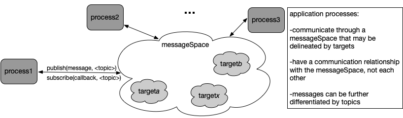
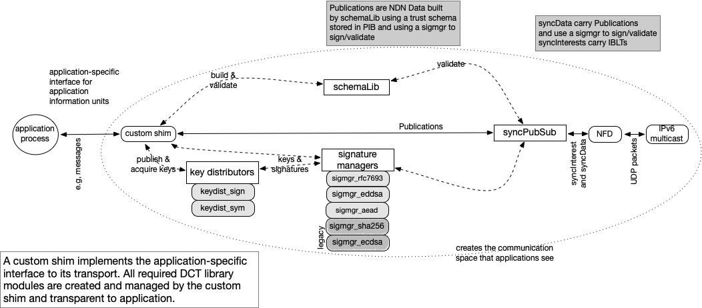

# Message-Based Publish/Subscribe (MBPS)

MBPS is a data-centric bespoke transport that presents applications with an MQTT-inspired interface. This directory contains three  example applications using a message-based publish/subscribe (MBPS) transport.    Each example uses a customized "shim", **mbps.hpp,** that implements an MBPS client and presents an API based on *messages* as an application level unit of information. The API is inspired by MQTT client APIs, but MBPS is *brokerless*. Three different levels of communication security are supplied in the three example trust schemas. The mbps.hpp shim and applications remain the same (same binary) and only the trust schema used in the bootstrap bundle input differ. 

An MBPS client presents a messageSpace where processes can publish and subscribe to messages in a particular application domain which may be further limited to a specific target within that domain.



Messages for a target may be further specified with topic and location information and subscriptions can be particularized by these topics or may just subscribe to all messages in the MBPS client's messageSpace or messageSpace target. If an MBPS client is created without a specific target value, the client will handle all the messages in its domain. An MBPS client is a client of a *distributed* *application* not of a *server* (or broker), and its implementation reflects that. For example, in MQTT, a message of type CONNECT is the first packet sent from the client to the server. To generate this message, MQTT applications usually call a client *connect* method, passing in a callback function to handle a CONNACK message from the server. Since MBPS is serverless, its *connect* method is used to do all initialization required in order to communicate (acquire keys, etc) and to call back to an application handler function once communications become possible.

## Build notes

MBPS works on Macs and Linux and uses IPv6 multicast. MBPS uses Data-Centric Toolkit (https://github.com/pollere/DCT)  which uses the ndn-ind library ([https://github.com/operantnetworks](https://github.com/operantnetworks)) and, for broadcast performance, NFD version with the the *no-nacks-on-multicast-faces* and s*hip-pending-interests-on-register* NFD patches as well as ndn-cxx patch (for keys) available at: https://github.com/pollere/NDNpatches. [Also must fix the bug that causes rejection of registrations within the same millisecond before can use key distributors.]  After cloning the DCT repo, the example programs can be used. Do a 'make' in your examples/mbps directory. 

## Using the examples

The **mbps** directory contains three applications (app1.cpp, app2.cpp, and app3.cpp) and three different text file trust schemas: mbps{0,1,2}.trust. The example applications are meant to provide simple illustrations of the use of MBPS and DCT trust schemas that can be extended and customized. Each trust schema implements a different security model that can be used with any of the applications interchangeably. The mbps1 and mbps2 trust schemas use a simple two level signing chain where publications are signed by a role cert that is signed by the root cert. The mbps0 trust schema checks that syncData and Publications are signed by a valid cert (same trust root) and follow a basic format, but doesn't enforce any required role cert to issue certain publications (e.g. mbps1.trust and mbps2.trust only let operators issue commands but mbps0.trust does not have this limit). In mbps1, publications are signed with their signing keys using a the EdDSA signature manager (DCT's cert distributor is used so that an entity can publish its own signing key chain and acquire and validate that of others) and Data packets are signed by their sender using the EdDSA signature manager. The mbps2 trust schema requires the AEAD signature manager for Data packets so those  will be encrypted (DCT's group key distributor is used to make and securely distribute those keys) while the Publications use the EdDSA signature manager.

 In the example applications, operator roles subscribe to all messages in the application domain and device roles only subscribe to the **command** topic and locations matching their IDs and the location designator *all*.  A single handler function (*msgRecv*) is used for all subscriptions. The *connect* lambda performs subscriptions, creates the first message body and invokes *msgPubr* which uses the client's publish function and schedules another message to be sent. The MBPS client's *run*() is called after *connect*().  app2.cpp's *msgPubr* does not schedule another message, instead the *msgRecv* method schedules a new message to be published after a short delay (and only if there's not another message pending in order to avoid an explosion of messages). The files also have examples of using message confirmation (roughly similar to MQTT QoS 1).

#### Creating Identity Bundles

Identity bundles of certificates are required to run these examples. The bundles contain, in order, the trust root certificate, the trust schema to be used (in cert form and signed by the trust root), and the signing chain for the entity. Bundles do **not** contain the signing certs of other devices that will be part of the application domain; the trust schema, common root-of-trust, and run-time library handle this, allowing entities to discover new members dynamically. The trust schema can be compiled using schemaCompile (recommend installation in tools directory).  The DCT/tools directory supplies utilities to create certs and id bundles and an application is invoked directly with its identity bundle. 

Acting as a Configurer, first, use the schemaCompile utility in the versec directory to compile the text file of trust rules into a binary schema, for mbps*n*, e.g.:

 `schemaCompile -o mbps1.scm mbps1.trust`

Next, a trust anchor (root) cert for this network and domain is created as a self-signed cert. The -s option is for the publication signature manager, the -o names the output file and finally the publication prefix for this application domain is listed:

 `make_cert -s EdDSA -o mbps1.root myNet/mbps1`

The output file contains a cert with the public key as content and the associated signing (private) key. The next step is to make a cert carrying the schema binary signed by the root cert in accordance with rules in the trust schema: 

  `schema_cert -o mbps1.schema mbps1.scm mbps1.root`

The cert content is the trust schema binary so there is no signing key in the output file. Next, make identity certs that are signed by the trust anchor. Make one for each planned instance of the application, particularizing by role (here **operator** or **device**) and by specifying an id within that role, e.g.:

 `    make_cert -s EdDSA -o alice.cert myNet/mbps1/operator/alice mbps1.root`

Make an identity bundle for each of these certs using the make_bundle utility in the tools directory, this one is given the identity name, e.g.:

 `make_bundle -o alice.bundle mbps1.root mbps1.schema +alice.cert`

The "+" on the role cert indicates that its signing (private) key should be included in the bundle. The other certs in the bundle don't (and shouldn't) have signing keys. In order to run the applications, at least two identities are needed, so make at least two bundles. In general, more identity bundles can be made later for additional application instances. A shell script *mkIDs.sh* is included that will generate five example bundles for the trust rule file given on the command line.

#### Running the examples

The host must be running an NDN Forwarding Daemon (with Pollere's patches) and must have a localnet route to the IPv6 multicast Face. At least two application entities should be started or nothing will happen.  (For now, do a "nfdc cs erase /localnet" before starting a new session.) app1 publishes the given number of messages, sending a short message each time. If the -p option is set, the application will persist waiting for more messages. 

*Example usage:*

`nfdc cs erase /localnet`

`app1 -c 10 <identity>.bundle `  *or* `app1 -c 10 -p <identity>.bundle `

app2 publishes an initial message and waits to receive a message before scheduling another message publication at a short delay.

*Example usage:*

`app2 <identity>.bundle`

app3 randomizes some publication components and removes the confirmation callbacks of app2.

*Example usage:*

`app3 <identity>.bundle`

In addition to a message body, mbps.hpp's *msgArgs* struct can be used to exchange additional information about a message with the MBPS client that can be used by the MBPS transport. 

```
struct msgArgs {
    msgArgs() {}
    bool dup{0};            //may be used to indicate duplicate
    std::string cap{};      //capability 
    std::string topic{};    //message type
    std::string loc{};      //location
    std::string args{};     //specifiers
    std::string ts{};       //message creation time
};
```

The MBPS transport is described in more detail below in the Elements of the MBPS Bespoke Transport section.

## Elements of the MBPS Bespoke Transport

This discussion contains somewhat more information about how the mbps shim uses the DCT library than is necessary in order to simply write applications and trust schemas. 

The MBPS transport implements its messageSpace using modules from Pollere's Data-Centric Toolkit (DCT) which  currently uses a version of the NDN Forwarding Daemon (NFD) to provide network layer primitives over an IPv6 multicast network. This section provides an overview of the module interaction. This is an area of active work, that is, we are still refining how the "pieces" go together; this is the current snapshot. The modules that uniquely define a particular transport are the shim (here mbps.hpp) and the trust schema (mpbs0.schema) while the rest are DCT library modules. mbps.hpp translates application messages into secured Publications (and Publications to messages) that are passed to and from a *SyncPubSub* object (in syncps.hpp) that manages the set synchronization of a particular Collection of Publications using NDN primitives (syncInterests and syncData). Publications are NDN Data which have distinct name components and a data portion that holds the message or a segment of a large message. (Publications are encapsulated in NDN Sync Data, which are exchanged with NDN forwarders, by SyncPubSub . Since the focus is on broadcast communications, those go to the **localnet** Face.) 

DCT's library is currently separated into four directories that cover different functionalities: syncps (the syncPubSub object and its helpers), sigmgrs (sign and validate Data using different algorithms), distributors (maintain a distributed key collection), and schema (holds the schemaLib modules). The figure shows how the various modules of DCT are used by a custom shim (like mbps.hpp) to make a bespoke transport that presents an application-specific interface and uses NFD and its IPv6 multicast interface to send and receive packets on a local network. In addition to the cryptographic signing and validation of Data packets (e.g., RFC7693, EdDSA, SHA256, AEAD), the schemaLib is employed to do construction and structural validation of Publications, ensuring that all of the schema's naming constraints hold for the publication and its signing chain.  DCT does not permit trust schemas to specify integrity signing (RFC7693 or SHA256) as this is at odds with DCT's security goals, but these are used within distributors to sign syncData during initialization.



### MBPS Publication Names

Each syncPubSub handles the synchronization of Publications within its Collection, which may encompass an entire application domain. Alternatively, a Collection may be further specified by a target. Publication names are constructed according to the following table, where the component structure can be used for hierarchical topic and subtopic handling and the individual components are specified in, and can be secured through, the domain's trust schema. 

| component  | description                                                                               |
| ---------- | ----------------------------------------------------------------------------------------- |
| networkID  | e.g., campus/main_building (multiple components for some deployments)                     |
| domain     | the top-level name for application communications, here **mbps**                          |
| target     | a capability, attribute, property                                                         |
| topic      | gives the type of message                                                                 |
| location   | target location id or alias, e.g. device(s), room, local, component (smartthings)         |
| arguments  | more specific information for this topic                                                  |
| origin     | identifies the publisher: role-specific ID and deviceID                                   |
| mesgID     | unsigned 32 bit number to uniquely identify each message                                  |
| sCnt       | unsigned 16 bit integer; indicates if single publication message or multiples (see below) |
| mtimestamp | time mbps client receives message from application process in UTC microsecs               |

A target is the "audience" for the Publication. This can be used in many ways, but one (IoT-centric) way to think of it is as a *capability* e.g., lock, alarm, colorControl, motionSensor. In general, topic can be used in many ways; in these examples it indicates the type of message carried, e.g. an event, a command, or a status. The target location can be a particular device, class of device, component of a device, a room, a vicinity. The arguments can supply any additional information associated with that topic. The origin component can be used to identify the publisher, mesgID is  set to a hash in mbps.hpp. sCnt is packaged in an unsigned 16 bit integer which, if not 0 to indicate a single publication message, uses the upper 8 bits for the sequence of this piece within the total message and the lower 8 bits for the total number of pieces in the message. This means that any message must fit into 255 publication segments (so byte-limited to maximum content size times 255) but the current shims limit the number of segments to 64 for an efficient implementation and for the iblt implementation, the limit should be kept under 80.

### Confirmation of Publications ("QoS")

MBPS provides mechanisms that enable applications to set a callback (if desired) indicating whether its message made it into the messageSpace. This relies on mechanisms in syncPubSub that can check that its Publication was seen on a SyncInterest issued by another process and methods in the shim that ensure all the Publications of any particular message have been confirmed. This gives an indication of message publication "success" roughly analogous to MQTT's QoS 1. It is invoked at the application by passing a callback to the mbps.hpp publish() method as the third argument. If the callback argument is not used, the option is not employed by the client. (Although mbps may not use it, the mechanism is employed for initial signing key distribution in the connect method, transparently to the application.)

### Notes on the included trust schemas

Identity bundles can be made using each of these trust schemas. Since a trust schema determines a particular trust zone, applications invoked with identity bundles with different trust schema will not communicate with each other. The security model can be changed just by using a set of identity bundles with the new trust schema while the application binary remains the same.

#### mbps0.trust

An entity needs the trust schema and a valid signing identity in order to sign and validate Publications. Both Publications and syncData are signed with the private key of the signing cert in the identity bundle using the EdDSA signature manager. There is no role differentiation so the schema has only type of Publication. 

Management and distribution of the signing certs is handled within the schema library modules and is transparent to both the application and mbps.hpp. The distributor *dist_cert.hpp* manages access to a cert Collection that contains all the certs needed to validate Publication and sync Data for an application. During connect(), each entity publishes its signing cert chain and subscribes to that of others in the Collection;  the application is called back when signing chain publication is confirmed.

#### mbps1.trust

This schema introduces operator and device role certs and derives additional Publication types that can require particular signing certs to be considered valid. As in mbps0.trust, the EdDSA signature manager is used for cryptographic signing of both Publications and syncData.

#### mbps2.trust

This schema differs from mbps1.trust only in that the wireValidator ensures privacy by encrypting all sync Data payloads using dynamically created and distributed symmetric keys. Its AEAD signature manager  requires a group key so an additional distributor, *dist_gkey.hpp* is automatically employed. Any client whose role permits it to create and distribute group keys attempts to become the key maker for the domain. (The simple self-selection algorithm used here could certainly be improved upon but is provided as an illustration.) Once a valid symmetric key is obtained, messages can be encrypted/decrypted so the application connect handler is called back. The AEAD signature manager is used to encrypt/decrypt SyncData while the Publications use EdDSA.

---

Copyright (C) 2021 Pollere, Inc
