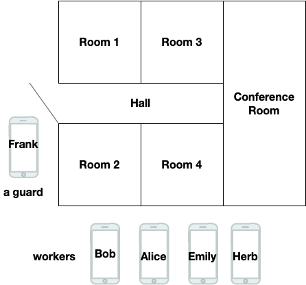

# Office Example

This example was created for the ACM ICN 2021 Tutorial and the slides from that portion of the tutorial are in this directory. The example concerns a small office that has:

- four people who use phone apps for access: Bob, Alice, Herb, and Emily. Alice is a manager.
- six rooms: four offices, a conference room, and a hall
- a room controller (raspPi-like) in each room that controls door lockset, light, temperature, screen and in hall controls light and door lockset

The rules for this office are:

- an employee controls all the functions in their assigned office
- a manager can also control the conference room and hall
- a guard (Frank is a guard) can control all door locks, lights, and temperature settings as a group (and not individually)
- a room controller publishes the status of its functions after it executes each command

Illustrated:



This example uses a generalized message-based pub/sub (mbps) shim that does not require a priori knowledge of the application or its communication schema. It just requires that the final three components of the schema-defined publications are the tags required and set by mpbs  (*mId*/*sCnt*/*mts*). The rest can be whatever is convenient for the application.

Keep in mind that schema rules are concerned with the *communications* of the applications that will form this trust domain and it is not necessary to cover every action that applications can perform. A schema writer should make sure that messages that could cause harm are not permitted. It's not necessary to prevent messages that an application would just discard (e.g., a phone app might tell a lock to "turn blue", but that would be meaningless to the lock which should discard it so it doesn't need to be restricted. If you have devices that enter an undefined state instead of throwing away undefined commands, then you ought to prevent them, of course). On the other hand, some commands are critical to prevent e.g., lights should not be issuing commands, and the schema can be used to ensure this, both preventing lightbulbs from creating such messages and preventing other devices from accepting them should a lightbulb somehow be compromised.

To experiment with this example, see *Installing and building the pieces* in the DCT/README.md file.

## Testing schemas

There are two schemas in this directory. The office.rules version implements the rules above. The basicOffice.rules version shows that you can use a schema to make a trust domain that is merely covered by publication signing certificates and does not have the fine-grained role enforcement. You can experiment with adding more rules and commands to office.rules, then use schemaCompile to check your schema: 

 `schemaCompile -d office.rules`

You should read the README and the language documents in the DCT/versec directory and make use of the tools in DCT/tools. The *bld_dump* utility takes an identity bundle argument and shows the certs in a bundle and lists the publications its can sign. The digraph portion of the output generated by schemaCompile can be pasted into the left hand panel at sketchviz.com to create the possible cert chains.

A possible exercise is to add a status message from employees indicating in-office or out-of-office or adding a guest role with permission to control the conference room screen.

## Testing the application

You can use the mkIDs.sh script to generate identity bundles and then start room controllers with room identities. The script can handle any combination of publication encryption (AEADSGN) or just signing (EdDSA) and pdu (or "wire") encryption (AEAD) or just signing (EdDSA). You can start all the rooms with the included *runRooms.sh* (you can *killall room* to stop) and then run phone applications from the command line by inputting the command along with an identity bundle for a user (e.g., alice.bundle, bob.bundle, emily.bundle, herb.bundle, frank.bundle). Examples:

```
./phone id/bob.bundle light on (room1 should turn on light)` 
./phone id/bob.bundle confRm light on (should print error msg)` 
./phone id/alice.bundle confRm light on (ok)` 
./phone id/alice.bundle all light on (err)` 
./phone id/frank.bundle light off (should turn all lights off)`
./phone id/frank.bundle screen off (err)
```


---

Copyright (C) 2021-2022 Pollere LLC 
