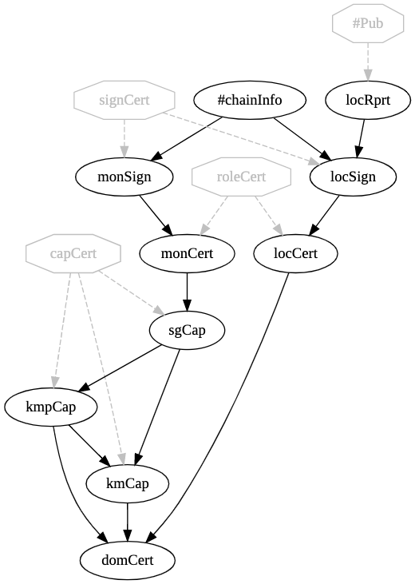

# Location Reporter Example with Publisher Privacy

This example is to illustrate the use of the publisher privacy signature managers *sigmgr_ppaead.hpp* and *sigmgr_ppsigned.hpp*. There are two types of applications: a location reporter that periodically publishes pseudo coordinates and a monitor that subscribes to these location reports. To keep locations private from other location reporters, the loc.trust schema adds privacy by encrypting either cAdds or Publications using a "publisher privacy" version of AEAD where subscribers must have a specific *capability* in their signing chain in order to decrypt cAdds/Publications of the Collection. 

The automatically deployed group key distributor, *dist_sgkey.hpp* creates a public/private key pair. In the key distribution publication, the public key is in the clear while the private key is encrypted for each entity with the appropriate *Subscriber Group* (SG) capability. Each publisher computes an encryption key using its own private key and the SG public key. SG entities use the SG private key with the publisher public key to compute the same symmetric key and decrypt.  Any entity whose role (from its signing identity) both puts it in the SG and permits it to create and distribute group keys attempts to become the key maker for the domain.

Use mkIDsPDU.sh with the PPAEAD signature manager set as the cAdd validator and the Publication validator set to use EdDSA to test this on cAdds. Use mkIDsPub.sh with the Publication Validator set to PPSIGN and the cAdd Validator set to either EdDSA or AEAD for the examples in this directory.

Using sketchviz.com's visualization of loc.trust's certDag with PPSIGN Pub Validator and AEAD cAdd Validator:



#### Running the example

First, use included script and schema to make identity bundles

```
mkdir bundles
cd bundles
../mkIDsP<DU,ub>.sh ../loc.trust
cd ..
```

In a terminal window:

`mon bundles/monitor1.bundle`

Optionally, in another terminal window:

`mon bundles/monitor2.bundle`

In another terminal window:

`runLocrs.sh` or `loc bundles/locRptr1.bundle`

There should be a short delay and then some command line output. Use of **dctwatch** in another window lets you observe the packets.

#### Add provenance

PPAEAD alone has the possible vulnerability that a SG member can create the encryption key that any publisher could create and thus fake the provenance. In PPsigned the encrypted packet is additionally signed to ensure provenance. This adds overhead, of course, so should only be used if this is a threat in your deployment. PPSigned is used on Publications since they are always signed.

#### Note

Applying publisher privacy on the Publication packet may be a better strategy for most applications.

Copyright (C) 2022-3 Pollere LLC
