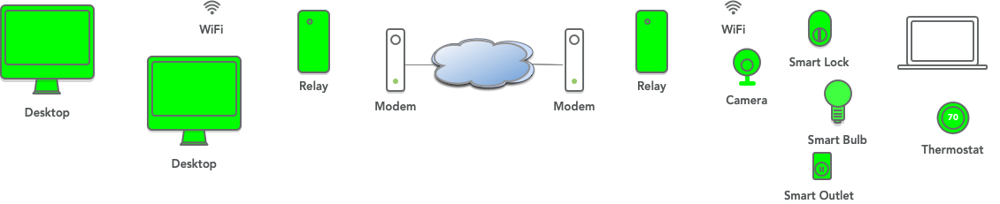

# Relays connect trust domains

Everything on the same subnet may not be in the same trust domain (TD) and entities in the same TD may not be on the same subnet. A single DeftT instance handles the former case; cState and cAdd PDUs of different TDs are differentiated by the leading trust domain id (thumbprint of the signed schema cert) component so a DeftT instance can ignore PDUs with different TD ids. Relays "pass through" Publications and never decrypt decrypt them nor are they given the keys to do so. The pass-through DeftTs of relaying applications must have a RLY capability in their identity chain whose argument specifies where they can "relay to" (e.g., a udp or tcp unicast link or a IPv6 link layer multicast address).

 In the second case, each subnet has a different sync zone (SZ), i.e., cStates and cAdds are not propagated off a subnet. A *relay* that has a DeftT instance in each subnet moves the Publications between SZs of the same trust domain (or overlapping subdomains).  When a trust domain needs to extend beyond a single subnet, Publications are relayed between SZs using identical schemas (though different signing/encryption may be specified for the cAdds).  Signing identities can be associated with an entire TD (including subsets), but cAdd encryption is specific to a particular subnet. The same relay set up can be used to connect trust sub-domains, where some of the subnets implement only some of the trust rules in their schemas. Relays handle the three sync collections of every DeftT: **pubs** which contains the information exchanged by applications, **cert** which contains the signing identity chains of member, and **keys** which contains all the information needed for group key encryption. The **keys** collection has two sub-collections, *keys/pdus* for encryption of cAdds and *keys/pubs* for encryption of the Publications in **pubs**. Pub encryption is across a trust domain so must be passed on by relays but relays cannot join the encryption group and pass encrypted Publications without decrypting. Encryption of cAdds is local to a subnet so *keys/pdus* is never relayed and relays must be members of any local cAdd encryption group.

Current work has focused on relaying between different networks in order to extend a trust domain (same trust root) with the same schema everywhere and relaying between different networks where some DeftTs are using schemas that are subsets of another schema. Relays can filter publications or just pass them through but a “default deny” has been most useful where the subschema of each DeftT is used.

One motivating case is pictured. A homeowner wants to gain access to their smart home from work, an internet cafe or perhaps from a second home. There must be a relay on each network. In the home, the relay needs one DeftT that is on the home wifi, part of that trust domain and in the same sync collection. The other DefT of the relay is connected through the Internet to a relay in another physical network. This connection is a unicast TCP or UDP connection. The other relay can be an application on the homeowner's phone which may not connect to a trust domain on its wifi network (e.g., the case of a work or cafe network). The home relay's externally facing DeftT can be using a limited subset of the house's schema for extra security.



Relays have a DeftT for each subnet, each with its own trust (or identity) bundle. The shim or API for relays is a "pass-through" *ptps.hpp*. Relay DeftTs *may* have identical bundles or bundles that are subsets or that overlap in some way. Bundles may specify different cAdd validation methods (through sigmgrs). In the Basic Relay, Publications received on each DeftT are published to all other DeftTs. If the schemas are **not** identical, publications are validated against the schema in the DeftT before publication is attempted; otherwise the (re)validation before publication *may* be skipped. Certificates from each DeftT are relayed to the other DeftT's cert stores which test them against their schemas for possible storage and publication.

Another motivating case is a hierarchical organization that wishes to isolate certain communications to the local or regional offices. All identities within the entire organization must have the same root of trust, but the schemas used at each location can be quite different, only overlapping in the Publications that relays should move between trust subdomains.


Additional features and filtering can be added to customize the Basic Relay. Publication confirmation can be used to determine if a something has gone wrong with a particular DeftT's communications (e.g., the physical link) and produce alerts and/or failover. The pass-through shim currently only uses lack of publication confirmation for this, but approaches tied directly to hardware feedback are possible. Relays can filter publications on any available fields, using them to discard Publications or to limit publication to particular DeftTs. A relay can also *subscribe*() to some subset of the Publications on a particular DeftT. For cAdd privacy signatures (AEAD), a different group key is used on each DeftT's collection.

### Example using hmIoT

**Note:** these examples are used for Pollere's testing and the "convenience" scripts to make bundles in the release may not be exactly the same as what is in this README. It's probably a good way to test your understanding but altering these scripts to do what you want.

A few examples use the examples/hmIot directory's applications with relays and the figure below. DCT/examples/relay directory contains ioth.rules (a copy of examples/hmIot/iot1.rules with relay specification added) and iote.rules, a subset of ioth.rules that *only* contains the frontDoor publications and uses AEAD for cAdds on an "external" interface. A script, mkIotIDs.sh, is included for making identity bundles that illustrate use of relays with the home IoT example. A relay element (*home*) in the home network has a multicast DeftT on the local home network and a unicast DeftT on an external link. A second relay (*away*) has a unicast DeftT on the external side and multicast on the local away side. A roamOp on the away network can produce the same commands as any operator but the away relay will only publish commands for the frontDoor to the external interface as relays use the iote.rules rules for their external DeftT. The external DeftT will not validate (thus will discard) commands to devices other than frontDoor. Looking at the schemas and the script to make the bundles will show:

- The **home** (green in figure) wifi network is using the ioth.rules schema

- The **away** (blue in figure) wifi network is using the ioth.rules schema (if testing this, note **away** network must be isolated from the **home** network)

- The relays run the iote.rules schema which only passes Publications with target location  *frontdoor* and implements AEAD encryption on the unicast link subnet.

- The trust domain encrypts its Publications using the AEADSGN signature manager, which is AEAD encrypted but also signed by the originating member. (Recall that **all** Publications must be signed.)


Note that the subscribe line in *relay.cpp* **may** be changed to:

    s.subscribe("frontdoor", pubRecv)

for the away multicast DeftT to reduce the work of relaying publications that the external away DeftT will not validate (thus not publish) but the external away DeftT's use of iote.rules means only publications with target location of frontdoor will be published so it isn't necessary.

Testing requires that the *home* and *away* networks be isolated so they are not able to overhear each other's multicast, or "local" side. (If the two test machines are on the same broadcast networks, this can be accomplished by setting to use loopback as in the scripts runHome.sh and runAway.sh.) Here, the two machines are referred to as *home* and *away*.

Edit the mkIotIDs.sh script to set the SRVR, PORT, and PROTO variables as needed for your set up. Create a subdirectory under relay for the identity bundles (here hmIoT), change to that directory and run

```
../mkIotIDs.sh ../ioth.rules
```

which creates identity bundles for all the interfaces. This directory should be copied to your *away* machine. On *home*, in examples/relay, start:

```
../hmIot/app2 ./hmIot/frontdoor.bundle
../hmIot/app2 ./hmIot/gate.bundle
```

The relay is started with a list (-l option) of identity bundles, one for each interface. Start the home relay:

```
relay -l "hmIoT/home.l.bundle,hmIoT/home.e.bundle"
```

On away, start a relay and the roaming operator:

```
relay -l "hmIoT/away.l.bundle,hmIoT/away.e.bundle"
../hmIot/app3 ./hmIoT/roamOp.bundle
```

Although the roaming operator publishes commands to both frontdoor and gate, only publications with a target of frontdoor are published in the sync zone on the external link so that only the home app with the frontdoor bundle will receive any messages from away and only target frontdoor messages will be relayed to the away network. 

On each machine, more instances of app2 can be started with other identity bundles (backdoor, gate, alice) as desired. If there is a frontdoor on the away machine, it will also receive the commands from roamOp. A gate on the away machine **will** receive roamOp's gate commands.

To test on the same machine, make a slightly different schema for the away local side and use localhost as the awayhostname.

Relays can also be used to extend a single trust domain geographically, with all relay DeftTs using an identical schema (with the possible exception of different cAdd signing/encryption). This would make the *home* and *away* sync zones appear as a single network to its entities. If AEAD signing is selected for the cAdds, each sync zone will be encrypted separately.

To use tcp instead of udp on **unicast** connections, put "tcp:" ahead of addresses, e.g. "tcp:34567" or "tcp:awayhostname:34567" in the corresponding RLY capability cert.

##### Extending relays

Relays can have more than two ports and there can be more than two relays in a path. This directory includes scripts to make identities and run the pictured configuration where the home and away relays are connected via TCP, the apartment and home also connect via TCP (using localhost here). Those two links both use the iote.rules that will only pass operator commands to frontdoor.


The identities can be set up using the mk3IotIDs.sh script which also make additional operator identities for bob and alice. The same frontdoor.bundle is used for the apartment frontdoor and the home frontdoor; each member makes its own signing keys, so their chains will be unique. Use run3Home.sh to start the home (yellow) members, runApt to start the apartment (green) members and runAway.sh to start the away (blue) members.

### Setting up distinct multicast subnets

To test relays on a single machine or a single broadcast network, subnets using different IPv6 multicast addresses can be used. If not set, a DeftT uses ff01::1234 as the default. The runAway.sh script shows setting the multicast address for the "away" entities to ff01::5678 and setting the away relay's unicast UDP port to use the local 127.0.0.1:34567 port. For testing on a single physical subnet, ff02 can be used. To better understand relaying, run examples while monitoring communications with *dctwatch*. When (re)setting multiple default IPv6 multicast addresses, local to host or network, it can be helpful to set up a dctwatch for each by setting the DCT_MULTICAST_ADDR environment variable on each command line, e.g.,

```
( setenv DCT_DEFAULT_IF en0; setenv DCT_MULTICAST_ADDR ff01::5678; dctwatch -h -n -d )
```

### Meshing relays

Relays can also be used to create meshes that require no specific configuration (other than the initial identity bundle). An example of how this can be used is shown below where bluetooth devices contain sensors and gateway (GW) devices are placed so that all BT devices can reach at least one. GWs also have longer-range WiFi network interfaces that mobile tablets can use and that can ensure that sensor and tablet communications reach GW5 which has a unicast link to remote controller with data storage.


This directory also contains a simplified example where sensors (sens.cpp), assumed to use a short-range wireless media, periodically publish reports of their measurements and subscribe to commands. Relays have one DeftT that uses the same media as the sensors (those get role ids of s<relay #>) and another that uses a longer-range broadcast media which a controller (cntrl.cpp) also uses (those get role ids of m<relay #>). The directory contains a schema for the sensor media, sensor.rules, and a schema for the longer-range media where relays are meshed, mesh.rules. Since the relay-only subdomain and the relay-and-sensor sub-domain have different subschemas, they can share the same broadcast network without "hearing" one another. The mkMesh.sh script can use the same RLY capability cert for both subdomains, specifying use of the default multicast address. 

To run this example, create a subdirectory for the identity bundles under relay (here mesh), change to that directory and run

```
../mkMeshIDs.sh ../mesh.rules
```

which creates the required identity bundles. The script uses the same RLY capability cert for all relay bundles so all will include the KM capability, even where it isn't used (i.e., on the sensor subnet using EdDSA for PDUs). To run from examples/relay, start:

```
cntrl mesh/cntrl.bundle &
runMesh.sh
```

"killall relay"" can be used to terminate the script.

The pmesh.rules and psensor.rules are for using the AEADSGN Pub encryption. To use those rulesets, Just

```
../mkpMesh.sh ../pmesh.rules
```

### References and related work

"Trust schemas and ICN: key to secure home IoT", K. Nichols, Proceedings of ACM ICN '21, September 2021 (available at https://dl.acm.org/doi/10.1145/3460417.3482972)

"Versec/DCT to create and use trust schemas", section of tutorial on **Power of Trust Schemas for Easy and Secure Deployment of NDN Applications** at ACM Conference on Information-Centric Networking, Paris, France, September, 2021, http://pollere.net/Pdfdocs/TrustSchemasTutorial_kmn.pdf

Early thoughts on relays at: http://pollere.net/Pdfdocs/NDNandOT.pdf. 

---

##### Copyright (C) 2022-3 Pollere LLC
